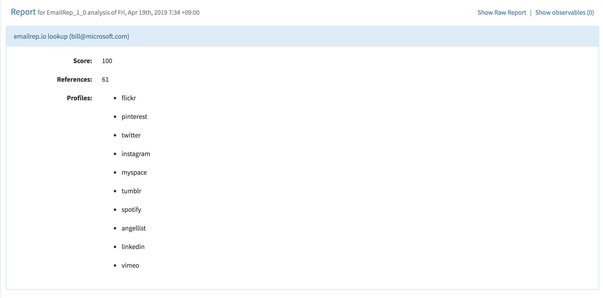

# emailrep-analyzer

Cortex Analyzer for [emailrep.io](https://emailrep.io/).

## Examples



```bash
$ echo '{ "data": "bill@microsoft.com", "dataType":"email"}' | python emailrep_analyzer.py | jq .
{
  "success": true,
  "summary": {
    "taxonomies": [
      {
        "level": "safe",
        "namespace": "EmailRep",
        "predicate": "Reputation",
        "value": 100
      }
    ]
  },
  "artifacts": [],
  "full": {
    "references": 61,
    "score": 100,
    "profiles": [
      "tumblr",
      "pinterest",
      "spotify",
      "instagram",
      "vimeo",
      "angellist",
      "myspace",
      "linkedin",
      "twitter",
      "flickr"
    ],
    "mail": "bill@microsoft.com"
  }
}
```

```bash
$ echo '{ "data": "null@null.com", "dataType":"email"}' | python emailrep_analyzer.py | jq .
{
  "success": false,
  "input": {
    "data": "null@null.com",
    "dataType": "email"
  },
  "errorMessage": "not deliverable"
}
```
